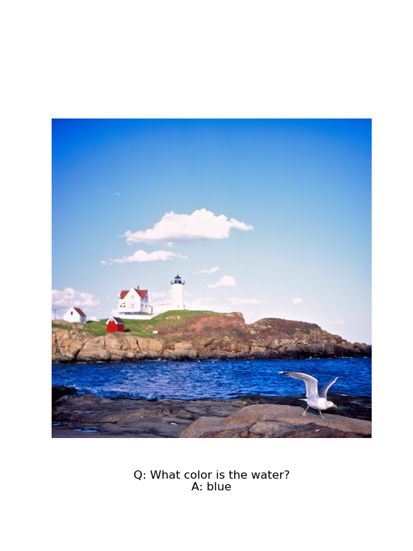

# Visual Language Model for Visual Question Answering (VLM-VQA)



## Overview

This repository contains the implementation of a **Visual Language Model for Visual Question Answering (VLM-VQA)**.  
The model combines:

- **DINOv2** as the vision encoder
- **Gemma 2 (2B)** as the language model

This design follows the ideas in the paper [PaliGemma: A Versatile 3B VLM for Transfer](https://arxiv.org/abs/2407.07726).

The model is trained specifically for **Visual Question Answering (VQA)**, achieving competitive performance.  
In addition to the model code, the repository includes **multi-GPU** training scripts with **DeepSpeed**, PyTorch **Distributed Data Parallel (DDP)**, and **Fully Sharded Data Parallel (FSDP)**.

---

## Architecture

### Vision Encoder — DINOv2
- **DINOv2** is a self-supervised Vision Transformer (ViT) pretrained on a large image corpus.
- Images are represented as sequences of fixed-size patches.
- The model learns rich image representations during pretraining, which are then used to extract features for downstream tasks.
- In VLM-VQA, DINOv2 produces embeddings of the input images, which are then passed to the language model.

### Language Model — Gemma 2 (2B)
- **Gemma 2** is a decoder-only Transformer language model (English only).
- Normally, it accepts sequences of text tokens and predicts the next token.
- To process image inputs, we add a **linear projector** that maps visual features to the same dimensional space as text tokens.

---

## Training

Training uses the **Trainer** API from the Hugging Face **Transformers** library.

| Parameter                   | Value             |
|-----------------------------|-------------------|
| batch_size                  | 6                 |
| gradient_accumulation_steps | 10                |
| learning_rate               | 1e-5              |
| weight_decay                | 1e-4              |
| dropout                     | 0.1               |
| optimizer                   | adamw_bnb_8bit    |
| lr_scheduler_type           | cosine            |
| warmup_ratio                | 0.01              |
| max_grad_norm               | 1.0               |
| percentile_clipping         | 95                |
| block_wise                  | True              |
| num_train_epochs            | 1                 |
| text_length                 | 64                |
| num_patches                 | 257               |
| visual_embed_dim            | 768               |

---

### Fully Sharded Data Parallel (FSDP)

- Trained on **4 × NVIDIA A10G** GPUs.
- **FSDP** shards model parameters, optimizer states, and gradients across GPUs.
- Uses **TRANSFORMER_BASED_WRAP** to selectively shard Transformer layers.
- Training command example:

```bash
accelerate launch \
  --config_file torch_distributed/fsdp2_config.yml \
  train.py \
  --token <your_hf_token> \
  --configs torch_distributed/fsdp_configs.ini
```


## Evaluation
The model was evaluated with the Holistic Evaluation of Language Models (HELM) framework.
- Benchmark: VQAv2 HELM (1K instances)
- Score: **0.5 BLEU**


## References

[1]: Alayrac, J.-B., et al. *PaliGemma: A Versatile 3B VLM for Transfer*. arXiv:2407.07726, 2024.  
[https://arxiv.org/abs/2407.07726](https://arxiv.org/abs/2407.07726)

[2]: Oquab, M., et al. *DINOv2: Learning Robust Visual Features without Supervision*. arXiv:2304.07193, 2023.  
[https://arxiv.org/abs/2304.07193](https://arxiv.org/abs/2304.07193)

[3]: Google DeepMind. *Gemma: Open Language Models Trained with RLHF*. Google Research Blog, 2024.  
[https://blog.google/technology/developers/gemma-open-models/](https://blog.google/technology/developers/gemma-open-models/)

[4]: Liang, P., et al. *Holistic Evaluation of Language Models*. arXiv:2211.09110, 2022.  
[https://arxiv.org/abs/2211.09110](https://arxiv.org/abs/2211.09110)

